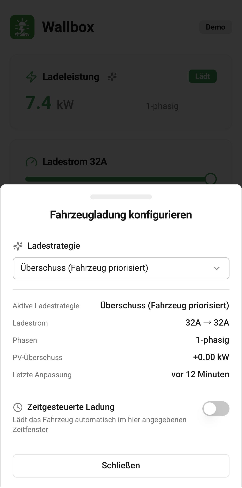
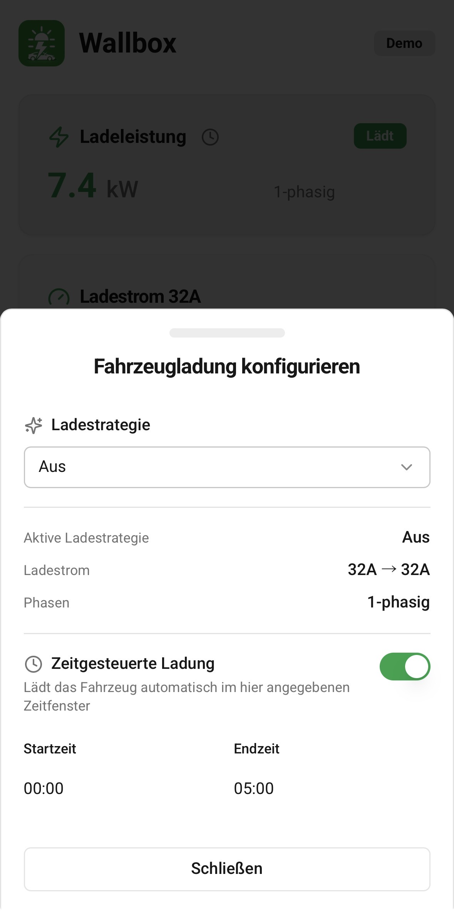
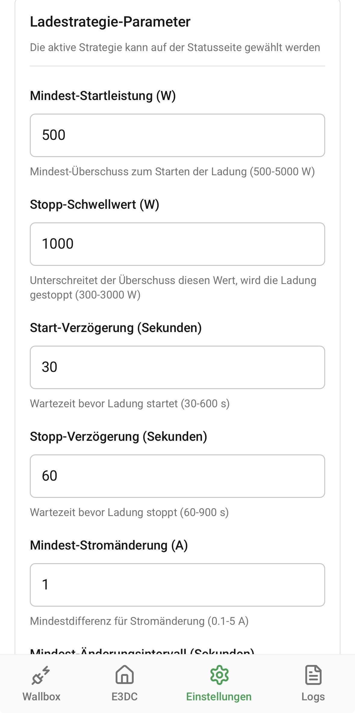
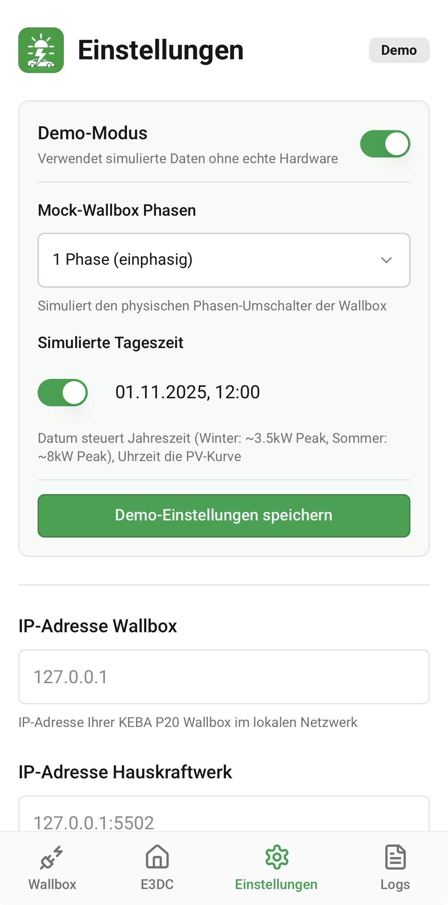

# EnergyLink

Eine moderne Progressive Web App (PWA) zur intelligenten Steuerung Ihrer KEBA Wallbox Ladestation für Elektrofahrzeuge mit E3DC S10 und SmartHome-Integration.

_Version 1.0 – November 2025_

## 🎭 Live-Demo ausprobieren

**Testen Sie die App ohne eigene Hardware:**  
👉 [**EnergyLink Demo auf Replit**](https://energy-link-ypqwbwd8nv.replit.app)

Die Demo simuliert eine KEBA P20 Wallbox und ein E3DC S10 System mit realistischen Daten, inklusive tageszeit-abhängiger PV-Produktion!

---

## Über die App

Mit dieser App behalten Sie die Kontrolle über Ihre Wallbox und Ihr Energiesystem - direkt vom Smartphone oder Tablet aus. Überwachen Sie den Ladevorgang in Echtzeit, nutzen Sie intelligente SmartHome-Funktionen und optimieren Sie Ihr Laden mit PV-Überschuss aus Ihrer E3DC S10 Anlage.

## Hauptfunktionen

### 📊 Echtzeit-Statusüberwachung

#### Wallbox-Monitoring
- **Ladeleistung:** Sehen Sie auf einen Blick die aktuelle Leistung in kW
- **Ladestrom:** Überwachen Sie den Stromfluss in Ampere über alle Phasen
- **Phasen-Erkennung:** Automatische Erkennung, ob 1-phasig oder 3-phasig geladen wird
- **Energie:** Verfolgen Sie die geladene Energie - wahlweise für die aktuelle Ladesitzung oder die Gesamtenergie
- **Kabelstatus:** Echtzeit-Tracking via UDP-Broadcasts
  - Automatische Erkennung von Kabelverbindungsänderungen
  - Unterstützt alle KEBA-Status: Getrennt, In Buchse, Verriegelt, Bereit, Laden
  - Persistierung mit Zeitstempel für lückenlose Nachverfolgung

#### E3DC S10 Energie-Monitoring
- **PV-Leistung:** Aktuelle Solarstrom-Produktion in Echtzeit
- **Batteriespeicher:** Ladezustand (SOC) und aktuelle Leistung
- **Hausverbrauch:** Gesamtstromverbrauch Ihres Haushalts (mit automatischer Wallbox-Korrektur)
- **Netzbezug/-einspeisung:** Aktueller Stromfluss vom/zum Netz
- **Autarkie & Eigenverbrauch:** Kennzahlen zur Energieeffizienz
- **Auto-Refresh:** Alle 5 Sekunden automatische Aktualisierung

### ⚡ Intelligente Ladestrategien

Wählen Sie aus **4 professionellen Ladestrategien**, die auf Ihre Bedürfnisse zugeschnitten sind:

#### 1️⃣ Überschuss (Batterie priorisiert)
- **Konzept:** Hausbatterie hat absolute Priorität - Wallbox erhält nur Überschuss NACH Batterie-Ladung
- **Ideal für:** Maximale Eigenverbrauchsoptimierung, Batterie-Schonung
- **Funktionsweise:** PV-Überschuss wird erst für die Hausbatterie verwendet, nur der Rest lädt das E-Auto
- **E3DC-Integration:** Direkte Berechnung aus E3DC-Daten ohne FHEM

#### 2️⃣ Überschuss (Fahrzeug priorisiert)
- **Konzept:** Wallbox und Hausbatterie teilen sich den PV-Überschuss
- **Ideal für:** Ausgewogenes Laden von Auto und Hausbatterie
- **Funktionsweise:** Beide Verbraucher erhalten parallel PV-Überschuss
- **Batterie-Schutz:** Automatische Reduktion bei längerer Batterie-Entladung

#### 3️⃣ Maximum (mit Batterie)
- **Konzept:** Maximale Ladeleistung durch Nutzung von PV + Batterie-Entladung
- **Ideal für:** Schnellstmögliches Laden, wenn E-Auto dringend voll sein muss
- **Funktionsweise:** Nutzt PV-Strom UND entlädt die Hausbatterie für maximale Wallbox-Leistung
- **Hinweis:** Reduziert die Autarkie des Haushalts

#### 4️⃣ Maximum (ohne Batterie)
- **Konzept:** Maximale Ladeleistung nur aus PV + Netz
- **Ideal für:** Schnelles Laden ohne Batterie-Entladung
- **Funktionsweise:** Nutzt PV-Strom maximal, Rest kommt aus dem Netz
- **Batterie bleibt geschont:** Keine Entladung der Hausbatterie

### 🔧 Erweiterte Strategie-Konfiguration

Feinjustierung aller Parameter für perfekte Anpassung:

- **Mindest-Startleistung:** Schwellwert zum Starten der Ladung (500-5000W)
- **Stopp-Schwellwert:** Unterschreitet der Überschuss diesen Wert, wird gestoppt (300-3000W)
- **Start-Verzögerung:** Wartezeit vor Ladestart bei ausreichend Überschuss (30-600s)
- **Stopp-Verzögerung:** Wartezeit vor Stopp bei zu wenig Überschuss (60-900s)
- **Mindest-Stromänderung:** Minimale Differenz für Stromänderung (0-5A)
- **Mindest-Änderungsintervall:** Mindestabstand zwischen Stromanpassungen (10-180s)

### 🏡 SmartHome-Integration

#### Zeitgesteuerte Ladung
- **Automatische Zeitfenster:** Konfigurierbare Start- und Endzeit (z.B. 00:00-05:00)
- **Ideal für Nachtstrom:** Nutzen Sie günstige Nachttarife
- **Maximale Leistung:** Lädt automatisch mit Maximalstrom im Zeitfenster
- **Strategie-Kombination:** Kann mit allen anderen Strategien kombiniert werden

#### Potenzialfreier Kontakt (X1) Steuerung
- **Automatische Strategieauswahl:** Konfigurierbare Ladestrategie für geschlossenen X1-Kontakt
- **Unterstützte Strategien:** Alle 4 Ladestrategien plus "Aus"
- **Echtzeit-Reaktion:** Sofortige Strategieänderung via UDP-Broadcast
- **Ideal für:** Externe SmartHome-Systeme, Zeitschaltuhren, Energiemanager

#### E3DC-spezifische Funktionen
- **Batteriesperrung:** Verhindert Batterie-Entladung zum Laden des Autos (via CLI-Tool)
- **Netzladung:** Lädt Hausbatterie aus dem Netz während der Nachtladung (via CLI-Tool)

### ⚙️ Einfache Einrichtung
- **Wallbox-IP-Adresse** konfigurieren
- **E3DC S10 Integration** (optional): IP-Adresse und Modbus TCP einrichten
  - Übersichtliche Akkordions für erweiterte Parameter
- **E3DC CLI-Tool** (e3dcset) für Batterie-/Netzsteuerung (optional)
  - Konfiguration in separatem Akkordion mit Hinweis-Box
- **Potenzialfreier Kontakt (X1)** Strategie festlegen (optional)
- Alle Einstellungen werden automatisch gespeichert

### 📋 Protokollierung & Diagnose
- **Logs-Seite:** Detaillierte Kommunikationsprotokolle mit der Wallbox
- Hilfreich bei der Fehlersuche und Diagnose
- Alle Befehle und Antworten werden aufgezeichnet

## Screenshots

### Status-Übersicht & Monitoring

<table>
<tr>
<td width="50%">
<strong>Wallbox Status-Seite</strong> 
Behalten Sie den Überblick über Ihre aktuelle Ladesitzung - Leistung, Strom, Phasen und Energie auf einen Blick
  

</td>
<td width="50%">
<strong>E3DC Energie-Monitoring</strong> 
Live-Daten Ihrer PV-Anlage: PV-Produktion, Batterie-SOC, Hausverbrauch, Netz, Autarkie
  

</td>
</tr>
</table>

### Ladestrategien konfigurieren

<table>
<tr>
<td width="50%">
<strong>Überschuss-Strategie</strong> 
Wählen Sie zwischen Batterie- oder Fahrzeug-priorisierter Ladung mit Live-Überschussanzeige
  

</td>
<td width="50%">
<strong>Zeitgesteuerte Ladung</strong> 
Konfigurieren Sie automatische Ladung in definierten Zeitfenstern für günstige Nachttarife
  

</td>
</tr>
</table>

### Erweiterte Einstellungen & System

<table>
<tr>
<td width="50%">
<strong>Strategie-Parameter</strong> 
Feinjustierung aller Schwellwerte und Verzögerungen für perfekte Anpassung an Ihr System
  

</td>
<td width="50%">
<strong>Demo-Modus & Einstellungen</strong> 
Testen Sie alle Funktionen ohne echte Hardware oder konfigurieren Sie Ihre Wallbox und E3DC
  

</td>
</tr>
</table>

### E3DC-Steuerung & Diagnose

<table>
<tr>
<td width="50%">
<strong>E3DC Batterie-Steuerung</strong> 
Aktivieren Sie Batteriesperrung und Netzladung während der Fahrzeugladung
  

</td>
<td width="50%">
<strong>Logs & Diagnose</strong> 
Detaillierte Kommunikationsprotokolle mit der Wallbox zur Fehlersuche und Analyse
  

</td>
</tr>
</table>

## Voraussetzungen

### Hardware (für lokale Installation)
- **KEBA Wallbox** (kompatible Modelle mit UDP-Schnittstelle, z.B. P20, P30)
- **Optional:** E3DC S10 Hauskraftwerk für erweiterte Energie-Monitoring und Batteriesteuerung
- **Netzwerkverbindung:** Alle Geräte im gleichen lokalen Netzwerk

### Software
- **E3DC S10 mit Modbus TCP:** Erforderlich für PV-Überschuss-Ladestrategien
  - Modbus TCP muss am E3DC aktiviert sein (Standard-Port 502)
  - Ermöglicht Live-Monitoring von PV, Batterie, Hausverbrauch, Netz
- **Optional:** E3DC CLI-Tool (e3dcset) für Batteriesperrung und Netzladung
  - GitHub: [mschlappa/e3dcset](https://github.com/mschlappa/e3dcset)
  - Ermöglicht Batteriesteuerung und Netzladung via Kommandozeile
- **Browser:** Moderner Webbrowser (Chrome, Safari, Firefox, Edge)

### Deployment-Optionen

#### Option 1: Live-Demo (sofort testen)
- **Replit Autoscale Deployment:** Kostenlose Demo mit simulierten Daten
- **Kosten:** ~$3-6/Monat (mit Replit Core Credits meist kostenlos)
- **Vorteile:** Keine Installation, sofort nutzbar, zum Ausprobieren
- **Link:** [EnergyLink Demo](https://energy-link-ypqwbwd8nv.replit.app)

#### Option 2: Lokale Installation (für echte Hardware)
- **Zielplattform:** Raspberry Pi, Home Server, NAS, Docker
- **Kosten:** Kostenlos (self-hosted)
- **Vorteile:** Volle Kontrolle, persistenter Speicher, Zugriff auf echte Hardware
- **Anleitung:** Siehe `DEPLOYMENT.md`

## Installation & Nutzung

### Als Progressive Web App (PWA) installieren

1. **App öffnen:** Öffnen Sie die App-URL in Ihrem mobilen Browser
   - Live-Demo: https://energy-link-ypqwbwd8nv.replit.app
   - Lokale Installation: http://[server-ip]:8080

2. **Zum Startbildschirm hinzufügen:**
   - **iOS (Safari):** Tippen Sie auf das Teilen-Symbol und wählen Sie "Zum Home-Bildschirm"
   - **Android (Chrome):** Tippen Sie auf das Menü (⋮) und wählen Sie "Zum Startbildschirm hinzufügen"

3. **App starten:** Die App erscheint wie eine native App auf Ihrem Startbildschirm

### Erste Schritte

#### 1. Wallbox-IP einstellen
- Gehen Sie zur Einstellungen-Seite (Zahnrad-Symbol)
- Tragen Sie die IP-Adresse Ihrer Wallbox ein (z.B. 192.168.40.16)
- In der Demo ist bereits die Mock-IP voreingetragen

#### 2. E3DC S10 konfigurieren (optional)
- **E3DC-Integration aktivieren:** Schalten Sie die E3DC-Integration ein
- **IP-Adresse:** Tragen Sie die IP Ihres E3DC S10 Systems ein (z.B. 192.168.40.50:502)
- **CLI-Tool Pfad:** Pfad zum e3dcset-Tool (z.B. `/opt/e3dcset`)
  - **Download:** [e3dcset auf GitHub](https://github.com/mschlappa/e3dcset)
  - Installation & Konfiguration siehe e3dcset README
- Nach Aktivierung erscheinen die E3DC-Monitoring-Seite und zusätzliche Steuerungs-Optionen

#### 3. Loslegen
- Wechseln Sie zur Status-Seite
- Sie sehen nun alle aktuellen Ladedaten
- Nutzen Sie die SmartHome-Controls für intelligente Ladefunktionen
- Bei aktivierter E3DC-Integration: Wechseln Sie zur E3DC-Seite für Energie-Monitoring

## Funktionsweise der Ladestrategien

### Überschuss-Strategien (Batterie/Fahrzeug priorisiert)

**Automatische Regelung:**
- Die App liest Live-Daten von Ihrem E3DC S10 System via Modbus TCP
- Berechnet automatisch den verfügbaren PV-Überschuss
- Passt den Ladestrom dynamisch an die aktuelle PV-Produktion an
- **On-the-fly Strategiewechsel:** Sie können jederzeit die Strategie wechseln, ohne die laufende Ladung zu stoppen

**Batterie priorisiert:**
- Formel: `Überschuss = (PV - Haus) - Batterie-Aufnahme`
- Hausbatterie wird immer zuerst geladen
- E-Auto erhält nur den Rest-Überschuss
- Maximale Eigenverbrauchsoptimierung

**Fahrzeug priorisiert:**
- Auto und Batterie teilen sich den PV-Überschuss gleichberechtigt
- Automatischer Batterie-Schutz bei längerer Entladung
- Ausgewogenes Verhältnis zwischen Autarkie und Auto-Ladung

**Intelligente Schwellwerte:**
- **Start-Schwellwert:** Ladung startet nur bei ausreichend Überschuss (konfigurierbar 500-5000W)
- **Stopp-Schwellwert:** Ladung stoppt bei zu wenig Überschuss (konfigurierbar 300-3000W)
- **Verzögerungen:** Vermeiden ständiges Ein/Aus bei Wolken (30-900s konfigurierbar)

### Maximum-Strategien (mit/ohne Batterie)

**Maximum mit Batterie:**
- Nutzt PV-Strom + Batterie-Entladung für maximale Wallbox-Leistung
- Ideal wenn E-Auto schnell voll sein muss
- Reduziert vorübergehend die Hausautarkie

**Maximum ohne Batterie:**
- Nutzt PV-Strom maximal, Rest aus dem Netz
- Batterie bleibt geschont und wird nicht entladen
- Schnelles Laden ohne Batterie-Verluste

### Zeitgesteuerte Ladung

**Automatisches Zeitfenster:**
- Konfigurierbare Start- und Endzeit (z.B. 00:00-05:00)
- Automatische Aktivierung zur Start-Zeit
- Lädt mit maximaler Leistung (32A bei 1-phasig, 16A bei 3-phasig)
- Ideal für günstige Nachtstromtarife
- Kann mit jeder anderen Strategie kombiniert werden

**Statusanzeige:**
- Ein Uhr-Icon zeigt an, wenn zeitgesteuerte Ladung aktiv ist
- Countdown bis zur nächsten automatischen Aktion

### E3DC-Integration

**Batteriesperrung:**
- Verhindert Batterie-Entladung zum Laden des E-Autos
- Wird via E3DC CLI-Tool ([e3dcset](https://github.com/mschlappa/e3dcset)) gesteuert
- Aktiviert/deaktiviert automatisch bei Ladestart/-stopp
- Statusanzeige: Batterie-Schloss-Icon

**Netzladung:**
- Lädt Hausbatterie aus dem Netz während der Nachtladung
- Nutzen Sie günstige Nachtstromtarife für die Hausbatterie
- Wird via E3DC CLI-Tool gesteuert
- Kann optional mit zeitgesteuerter Ladung kombiniert werden

## Häufige Fragen (FAQ)

**Warum wird kein Wallbox-Status angezeigt?**
- Prüfen Sie, ob Smartphone und Wallbox im gleichen WLAN sind
- Überprüfen Sie die IP-Adresse in den Einstellungen
- Starten Sie die App neu
- In der Demo: Prüfen Sie, ob der Mock-Server läuft (sollte automatisch starten)

**Warum wird keine E3DC-Daten angezeigt?**
- Stellen Sie sicher, dass E3DC-Integration in den Einstellungen aktiviert ist
- Überprüfen Sie die E3DC-IP-Adresse (Format: IP:Port, z.B. 192.168.40.50:502)
- Die E3DC-Seite erscheint erst nach Aktivierung der E3DC-Integration
- In der Demo: E3DC-Mock läuft automatisch auf 127.0.0.1:5502

**Welche Ladestrategie soll ich wählen?**
- **Überschuss (Batterie priorisiert):** Wenn Ihre Hausbatterie Priorität haben soll - beste Eigenverbrauchsoptimierung
- **Überschuss (Fahrzeug priorisiert):** Wenn Auto und Batterie gleichberechtigt laden sollen
- **Maximum (mit Batterie):** Wenn das Auto schnell voll sein muss und Batterie-Entladung OK ist
- **Maximum (ohne Batterie):** Wenn das Auto schnell laden soll, aber Batterie geschont werden soll
- **Tipp:** Sie können jederzeit die Strategie wechseln, auch während des Ladens!

**Kann ich die Strategie während des Ladens wechseln?**
- Ja! Die App unterstützt "on-the-fly" Strategiewechsel
- Die Ladung wird nicht unterbrochen
- Der neue Ladestrom wird innerhalb von 15 Sekunden angepasst

**Warum lädt mein Auto nicht bei Überschuss-Strategie?**
- Prüfen Sie, ob ausreichend PV-Überschuss vorhanden ist (mindestens Mindest-Startleistung)
- Achten Sie auf die Start-Verzögerung (default: 30s) - die Ladung startet nicht sofort
- Bei "Batterie priorisiert": Die Hausbatterie muss erst voll/gesättigt sein
- Überprüfen Sie in den Strategie-Parametern die konfigurierten Schwellwerte

**Wie sehe ich, ob extern Änderungen vorgenommen wurden?**
- Die Wallbox-Daten werden alle 5 Sekunden automatisch aktualisiert
- E3DC-Daten werden alle 5 Sekunden automatisch aktualisiert
- Externe Änderungen werden automatisch angezeigt

**Kann ich die App auch unterwegs nutzen?**
- Die lokale Installation ist für die Nutzung im Heimnetzwerk konzipiert
- Für Fernzugriff benötigen Sie VPN oder eine sichere Reverse-Proxy-Lösung
- **Live-Demo:** Von überall aus erreichbar (Replit Autoscale)
- **Sicherheitshinweis:** Schützen Sie den Zugriff auf Ihre Wallbox und E3DC-System!

**Wo finde ich Fehlerprotokolle?**
- Wechseln Sie zur Logs-Seite (Listen-Symbol in der Navigation)
- Hier sehen Sie alle Kommunikationsdetails mit der Wallbox
- Hilfreich bei Problemen zur Fehlersuche

**Wie funktioniert die Demo?**
- Die Demo nutzt einen eingebauten Mock-Server
- Simuliert KEBA Wallbox und E3DC S10 System
- Realistische Daten mit tageszeit-abhängiger PV-Produktion und saisonalen Variationen
- Alle Ladestrategien sind voll nutzbar
- **Erweiterte Demo-Steuerung:** In den Einstellungen können Sie den Kabel-Status (Plug) manuell ändern (Getrennt, In Buchse, Verriegelt, Bereit, Laden)
- Keine echte Hardware erforderlich

**Wie installiere ich die App lokal?**
- Siehe vollständige Anleitung in `DEPLOYMENT.md`
- Quick Start für Replit Autoscale: Siehe `README-AUTOSCALE.md`
- Docker-Deployment: Siehe `README.Docker.md`

## Technische Details

### Frontend
- **Framework:** React 18+ mit TypeScript (Vite)
- **Routing:** Wouter (minimalistisch, PWA-optimiert)
- **State Management:** TanStack Query v5 (für Server-State)
- **UI-Komponenten:** shadcn/ui (Radix UI Primitives)
- **Styling:** Tailwind CSS mit Material Design 3 Prinzipien
- **Mobile-First:** Optimiert für Touch-Geräte

### Backend
- **Runtime:** Node.js mit Express.js, TypeScript
- **Kommunikation:** 
  - **KEBA Wallbox:** UDP-Protokoll (Port 7090) mit Broadcast-Listener
  - **E3DC S10:** Modbus TCP (Port 502) für Live-Daten
  - **E3DC Steuerung:** CLI-Tool (e3dcset) für Batterie-/Netzladung
- **Datenhaltung:** File-based JSON Storage mit Atomicity
- **Broadcast-Handler:** Echtzeit-Erkennung von Wallbox-Statusänderungen (Input X1, Plug, State, E pres)
- **Logging:** Strukturiertes Logging mit Log-Levels

### Ladestrategien-Controller
- **Polling-Intervall:** 15 Sekunden (automatische Überprüfung)
- **Phasen-Erkennung:** Automatisch aus Stromwerten (1P/3P)
- **Surplus-Berechnung:** Direkt aus E3DC Modbus-Daten
- **Dwell-Time Protection:** 30s Mindestabstand zwischen Stromanpassungen
- **On-the-fly Switching:** Strategiewechsel ohne Lade-Unterbrechung

### Demo-Modus
- **Unified Mock Server:** Simuliert Wallbox und E3DC S10 in einem Prozess
- **Realistische Simulation:** Tageszeit-abhängige PV-Kurven, saisonale Variation (November: ~3.5kW Peak, Sommer: ~8kW Peak)
- **Auto-Start:** Startet automatisch bei DEMO_AUTOSTART=true
- **State-Synchronisation:** Wallbox-Leistung beeinflusst E3DC Grid-Berechnung
- **Realistische Haushaltslasten:** Morgen-/Mittag-/Abend-Peaks mit Basis-Verbrauch
- **Plug-Status-Steuerung:** Manuelles Setzen aller KEBA-Kabelstatus via Settings-Dropdown (Getrennt, In Buchse, Verriegelt, Bereit, Laden)
- **Broadcast-Simulation:** Automatische UDP-Broadcasts bei Statusänderungen

### Sicherheit & Zuverlässigkeit
- **CLI Output Sanitization:** Sichere Ausführung von E3DC-Befehlen
- **Modbus Auto-Recovery:** Automatische Wiederverbindung bei Verbindungsabbruch
- **Atomic File Writes:** Crash-sichere Datenpersistenz
- **Type Safety:** Zod-Schemas für Runtime-Validierung

### Zeitzone & Lokalisierung
- **Feste Zeitzone:** Europe/Berlin für alle zeitbasierten Operationen
- **Sprache:** Deutsch (UI, Logs, Dokumentation)
- **Offline-Fähigkeit:** App funktioniert ohne Internet (nur lokales Netzwerk)

## Sicherheitshinweise

- Die App kommuniziert nur im lokalen Netzwerk (bei lokaler Installation)
- Keine Daten werden an externe Server gesendet (außer bei Replit-Demo)
- Schützen Sie Ihr WLAN-Netzwerk mit einem sicheren Passwort
- Bei Fernzugriff: Verwenden Sie VPN statt direkter Port-Weiterleitung
- E3DC CLI-Befehle werden sicher ausgeführt mit Output-Sanitization
- API-Keys und Credentials sollten niemals im Repository gespeichert werden

## Support & Feedback

Bei Fragen oder Problemen:
- Überprüfen Sie zunächst die FAQ oben
- Schauen Sie in die Logs-Seite für detaillierte Fehlerinformationen
- Stellen Sie sicher, dass alle Netzwerkverbindungen funktionieren
- Technische Dokumentation: Siehe `DEPLOYMENT.md`
- GitHub Issues: [Repository-Link]

## Deployment-Anleitungen

- **Quick Start (Replit Autoscale):** `README-AUTOSCALE.md`
- **Vollständige Deployment-Anleitung:** `DEPLOYMENT.md`
- **Docker-Deployment:** `README.Docker.md`

## Lizenz & Haftungsausschluss

Diese Software wird "wie besehen" zur Verfügung gestellt. Die Nutzung erfolgt auf eigene Verantwortung. Der Entwickler übernimmt keine Haftung für Schäden, die durch die Nutzung dieser App entstehen könnten.

---

**Viel Erfolg beim intelligenten Laden Ihres Elektrofahrzeugs! ⚡🚗**

_Entwickelt mit ❤️ für nachhaltige Mobilität und Energieeffizienz_
