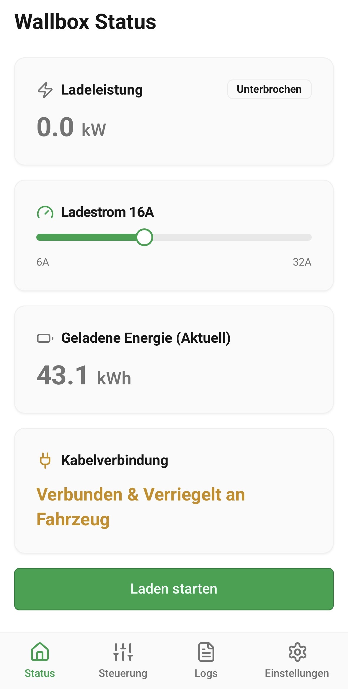
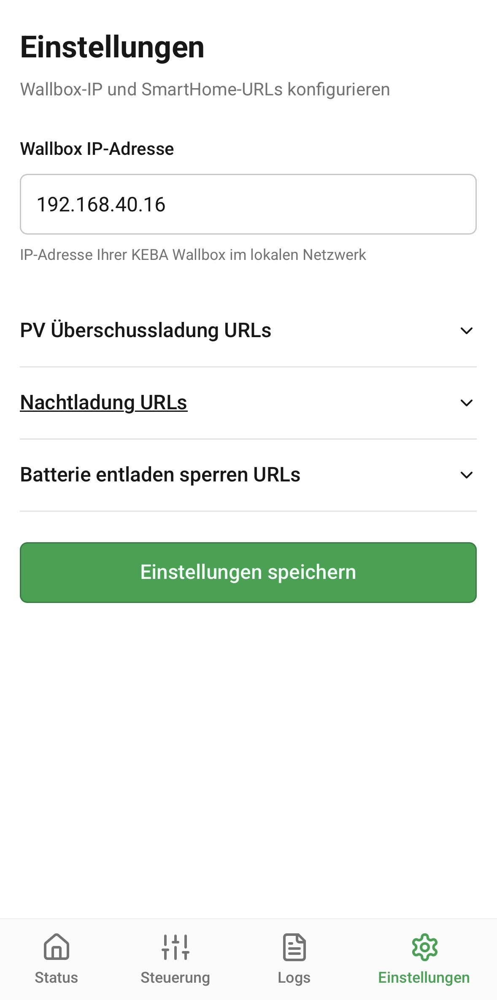
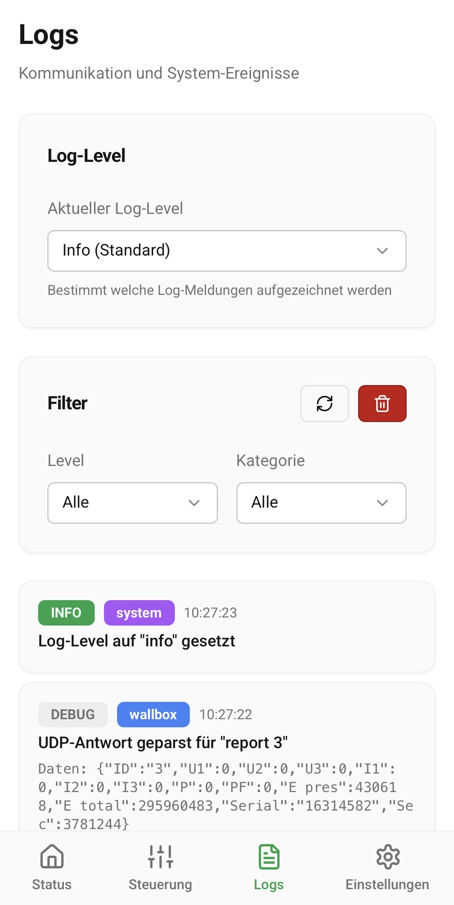

# EnergyLink

Eine moderne Progressive Web App (PWA) zur intelligenten Steuerung Ihrer KEBA Wallbox Ladestation für Elektrofahrzeuge mit E3DC S10 und SmartHome-Integration.

_Version 2.0 – November 2025_

## 🎭 Live-Demo ausprobieren

**Testen Sie die App ohne eigene Hardware:**  
👉 [**EnergyLink Demo auf Replit**](https://energylink.replit.app)

Die Demo simuliert eine KEBA P20 Wallbox und ein E3DC S10 System mit realistischen Daten, inklusive tageszeit-abhängiger PV-Produktion!

---

## Über die App

Mit dieser App behalten Sie die Kontrolle über Ihre Wallbox und Ihr Energiesystem - direkt vom Smartphone oder Tablet aus. Überwachen Sie den Ladevorgang in Echtzeit, nutzen Sie intelligente SmartHome-Funktionen und optimieren Sie Ihr Laden mit PV-Überschuss aus Ihrer E3DC S10 Anlage.

## Hauptfunktionen

### 📊 Echtzeit-Statusüberwachung

#### Wallbox-Monitoring
- **Ladeleistung:** Sehen Sie auf einen Blick die aktuelle Leistung in kW
- **Ladestrom:** Überwachen Sie den Stromfluss in Ampere über alle Phasen
- **Energie:** Verfolgen Sie die geladene Energie - wahlweise für die aktuelle Ladesitzung oder die Gesamtenergie
- **Kabelstatus:** Erkennen Sie sofort, ob das Ladekabel angeschlossen ist

#### E3DC S10 Energie-Monitoring
- **PV-Leistung:** Aktuelle Solarstrom-Produktion in Echtzeit
- **Batteriespeicher:** Ladezustand (SOC) und aktuelle Leistung
- **Hausverbrauch:** Gesamtstromverbrauch Ihres Haushalts
- **Netzbezug/-einspeisung:** Aktueller Stromfluss vom/zum Netz
- **Autarkie & Eigenverbrauch:** Kennzahlen zur Energieeffizienz
- **Auto-Refresh:** Alle 5 Sekunden automatische Aktualisierung

### ⚡ Intelligente Ladesteuerung
- **Manueller Start/Stop:** Starten oder stoppen Sie den Ladevorgang mit einem Fingertipp
- **Ladestrom einstellen:** Passen Sie die Ladeleistung individuell an (6-16 Ampere)

### 🏡 SmartHome-Integration

Optimieren Sie Ihr Laden mit intelligenten Funktionen:

#### PV-Überschussladung
- Laden Sie automatisch, wenn Ihre Solaranlage überschüssigen Strom produziert
- Maximale Eigenverbrauchsoptimierung
- Integration mit FHEM SmartHome-System

#### Nachtladung (zeitgesteuert)
- Nutzen Sie günstige Nachttarife durch automatisches zeitgesteuertes Laden
- Konfigurierbare Start- und Endzeit
- Automatische Aktivierung zur eingestellten Zeit

#### E3DC-spezifische Funktionen
- **Batteriesperrung:** Verhindern Sie, dass Ihre Hausbatterie zum Laden des Autos entladen wird (nur bei E3DC-Integration)
- **Netzladung:** Laden Sie Ihre Hausbatterie aus dem Netz während der Nachtladung (optional, nur bei E3DC-Integration)

### ⚙️ Einfache Einrichtung
- Wallbox-IP-Adresse konfigurieren
- E3DC S10 IP-Adresse und CLI-Tool einrichten (optional)
- SmartHome-Webhooks für FHEM-Integration einrichten (optional)
- Alle Einstellungen werden automatisch gespeichert

### 📋 Protokollierung & Diagnose
- **Logs-Seite:** Detaillierte Kommunikationsprotokolle mit der Wallbox
- Hilfreich bei der Fehlersuche und Diagnose
- Alle Befehle und Antworten werden aufgezeichnet

## Screenshots

### Status & E3DC Monitoring

<table>
<tr>
<td width="50%">
<strong>Wallbox Status-Seite</strong> 
Behalten Sie den Überblick über Ihre aktuelle Ladesitzung
  

</td>
<td width="50%">
<strong>E3DC Energie-Monitoring</strong> 
Live-Daten Ihrer PV-Anlage und Batteriespeicher
  

</td>
</tr>
</table>

### Batterie-Steuerung & Einstellungen

<table>
<tr>
<td width="50%">
<strong>E3DC Batterie-Steuerung</strong> 
Intelligente Steuerung Ihrer Hausbatterie während des Ladevorgangs
  

</td>
<td width="50%">
<strong>Einstellungen</strong> 
Konfigurieren Sie Wallbox, E3DC und SmartHome-Verbindungen
  

</td>
</tr>
</table>

### SmartHome-Steuerung & Protokollierung

<table>
<tr>
<td width="50%">
<strong>Wallbox SmartHome-Steuerung</strong> 
Konfigurieren Sie zeitgesteuerte Ladung und PV-Überschussladung
  

</td>
<td width="50%">
<strong>Logs & Diagnose</strong> 
Detaillierte Kommunikationsprotokolle zur Fehlersuche
  

</td>
</tr>
</table>

## Voraussetzungen

### Hardware (für lokale Installation)
- **KEBA Wallbox** (kompatible Modelle mit UDP-Schnittstelle, z.B. P20, P30)
- **Optional:** E3DC S10 Hauskraftwerk für erweiterte Energie-Monitoring und Batteriesteuerung
- **Netzwerkverbindung:** Alle Geräte im gleichen lokalen Netzwerk

### Software
- **Optional:** FHEM SmartHome-System für automatische PV-Überschuss-Ladefunktionen
- **Optional:** E3DC CLI-Tool (e3dcset) für Batteriesperrung und Netzladung
  - GitHub: [mschlappa/e3dcset](https://github.com/mschlappa/e3dcset)
  - Ermöglicht Batteriesteuerung und Netzladung via Kommandozeile
- **Browser:** Moderner Webbrowser (Chrome, Safari, Firefox, Edge)

### Deployment-Optionen

#### Option 1: Live-Demo (sofort testen)
- **Replit Autoscale Deployment:** Kostenlose Demo mit simulierten Daten
- **Kosten:** ~$3-6/Monat (mit Replit Core Credits meist kostenlos)
- **Vorteile:** Keine Installation, sofort nutzbar, zum Ausprobieren
- **Link:** [EnergyLink Demo](https://energylink.replit.app)

#### Option 2: Lokale Installation (für echte Hardware)
- **Zielplattform:** Raspberry Pi, Home Server, NAS, Docker
- **Kosten:** Kostenlos (self-hosted)
- **Vorteile:** Volle Kontrolle, persistenter Speicher, Zugriff auf echte Hardware
- **Anleitung:** Siehe `DEPLOYMENT.md`

## Installation & Nutzung

### Als Progressive Web App (PWA) installieren

1. **App öffnen:** Öffnen Sie die App-URL in Ihrem mobilen Browser
   - Live-Demo: https://energylink.replit.app
   - Lokale Installation: http://[server-ip]:8080

2. **Zum Startbildschirm hinzufügen:**
   - **iOS (Safari):** Tippen Sie auf das Teilen-Symbol und wählen Sie "Zum Home-Bildschirm"
   - **Android (Chrome):** Tippen Sie auf das Menü (⋮) und wählen Sie "Zum Startbildschirm hinzufügen"

3. **App starten:** Die App erscheint wie eine native App auf Ihrem Startbildschirm

### Erste Schritte

#### 1. Wallbox-IP einstellen
- Gehen Sie zur Einstellungen-Seite (Zahnrad-Symbol)
- Tragen Sie die IP-Adresse Ihrer Wallbox ein (z.B. 192.168.40.16)
- In der Demo ist bereits die Mock-IP voreingetragen

#### 2. E3DC S10 konfigurieren (optional)
- **E3DC-Integration aktivieren:** Schalten Sie die E3DC-Integration ein
- **IP-Adresse:** Tragen Sie die IP Ihres E3DC S10 Systems ein (z.B. 192.168.40.50:502)
- **CLI-Tool Pfad:** Pfad zum e3dcset-Tool (z.B. `/opt/e3dcset`)
  - **Download:** [e3dcset auf GitHub](https://github.com/mschlappa/e3dcset)
  - Installation & Konfiguration siehe e3dcset README
- Nach Aktivierung erscheinen die E3DC-Monitoring-Seite und zusätzliche Steuerungs-Optionen

#### 3. SmartHome-URLs konfigurieren (optional)
- Wenn Sie FHEM nutzen, tragen Sie die Webhook-URLs für PV-Überschussladung ein
- Die App synchronisiert dann automatisch mit Ihren SmartHome-Geräten
- Standard-URLs sind bereits als Beispiel eingetragen

#### 4. Loslegen
- Wechseln Sie zur Status-Seite
- Sie sehen nun alle aktuellen Ladedaten
- Nutzen Sie die SmartHome-Controls für intelligente Ladefunktionen
- Bei aktivierter E3DC-Integration: Wechseln Sie zur E3DC-Seite für Energie-Monitoring

## Funktionsweise der SmartHome-Funktionen

### PV-Überschussladung
**Wenn aktiviert:**
- Die App kommuniziert mit Ihrer Solaranlage über FHEM
- Bei Stromüberschuss wird automatisch geladen
- Bei wenig Sonne wird der Ladevorgang pausiert
- **Hinweis:** Der Ladestrom-Regler wird deaktiviert, da die Leistung automatisch gesteuert wird
- **Statusanzeige:** Ein Solarenergie-Icon zeigt an, wenn PV-Überschussladung aktiv ist

### Nachtladung
**Wenn aktiviert:**
- Zeitgesteuertes Laden nach konfiguriertem Zeitplan (z.B. 00:00-05:00)
- Automatische Aktivierung zur Start-Zeit, automatische Deaktivierung zur End-Zeit
- Ladestrom wird automatisch auf Maximum gesetzt für schnellstes Laden
- Ideal für günstige Nachtstromtarife
- **Statusanzeige:** Ein Mond-Icon zeigt an, wenn Nachtladung aktiv ist

### Batteriesperrung (nur E3DC)
**Wenn aktiviert:**
- Ihre E3DC-Hausbatterie wird nicht zum Laden des E-Autos genutzt
- Verhindert unnötige Lade-/Entladeverluste der Hausbatterie
- Die Wallbox lädt nur mit Netzstrom oder direktem PV-Überschuss
- **Steuerung:** Via E3DC CLI-Tool ([e3dcset](https://github.com/mschlappa/e3dcset))
- **Statusanzeige:** Ein Batterie-Schloss-Icon zeigt an, wenn die Batterie gesperrt ist

### Netzladung der Batterie (nur E3DC)
**Wenn aktiviert:**
- Lädt Ihre E3DC-Hausbatterie aus dem Netz während der Nachtladung
- Nutzen Sie günstige Nachtstromtarife zum Laden der Hausbatterie
- Kann optional mit Nachtladung kombiniert werden
- **Steuerung:** Via E3DC CLI-Tool ([e3dcset](https://github.com/mschlappa/e3dcset))

## Häufige Fragen (FAQ)

**Warum wird kein Wallbox-Status angezeigt?**
- Prüfen Sie, ob Smartphone und Wallbox im gleichen WLAN sind
- Überprüfen Sie die IP-Adresse in den Einstellungen
- Starten Sie die App neu
- In der Demo: Prüfen Sie, ob der Mock-Server läuft (sollte automatisch starten)

**Warum wird keine E3DC-Daten angezeigt?**
- Stellen Sie sicher, dass E3DC-Integration in den Einstellungen aktiviert ist
- Überprüfen Sie die E3DC-IP-Adresse (Format: IP:Port, z.B. 192.168.40.50:502)
- Die E3DC-Seite erscheint erst nach Aktivierung der E3DC-Integration
- In der Demo: E3DC-Mock läuft automatisch auf 127.0.0.1:5502

**Der Ladestrom-Regler ist ausgegraut - warum?**
- Bei aktivierter PV-Überschussladung wird der Strom automatisch geregelt
- Deaktivieren Sie PV-Überschussladung, um manuell zu steuern
- Wenn kein Kabel angeschlossen ist, kann der Strom nicht eingestellt werden

**Wie sehe ich, ob extern Änderungen vorgenommen wurden?**
- Die Wallbox-Daten werden alle 5 Sekunden automatisch aktualisiert
- E3DC-Daten werden alle 5 Sekunden automatisch aktualisiert
- Externe Änderungen werden automatisch angezeigt

**Kann ich die App auch unterwegs nutzen?**
- Die lokale Installation ist für die Nutzung im Heimnetzwerk konzipiert
- Für Fernzugriff benötigen Sie VPN oder eine sichere Reverse-Proxy-Lösung
- **Live-Demo:** Von überall aus erreichbar (Replit Autoscale)
- **Sicherheitshinweis:** Schützen Sie den Zugriff auf Ihre Wallbox und E3DC-System!

**Wo finde ich Fehlerprotokolle?**
- Wechseln Sie zur Logs-Seite (Listen-Symbol in der Navigation)
- Hier sehen Sie alle Kommunikationsdetails mit der Wallbox
- Hilfreich bei Problemen zur Fehlersuche

**Wie funktioniert die Demo?**
- Die Demo nutzt einen eingebauten Mock-Server
- Simuliert KEBA Wallbox, E3DC S10 und FHEM SmartHome
- Realistische Daten mit tageszeit-abhängiger PV-Produktion
- Alle Funktionen sind voll nutzbar
- Keine echte Hardware erforderlich

**Wie installiere ich die App lokal?**
- Siehe vollständige Anleitung in `DEPLOYMENT.md`
- Quick Start für Replit Autoscale: Siehe `README-AUTOSCALE.md`
- Docker-Deployment: Siehe `README.Docker.md`

## Technische Details

- **Entwickelt als:** Progressive Web App (PWA)
- **Frontend:** React 18+, TypeScript, Wouter, TanStack Query, shadcn/ui
- **Backend:** Node.js, Express.js, TypeScript
- **Design:** Material Design 3 Prinzipien
- **Optimiert für:** Mobile Geräte (Smartphones & Tablets)
- **Sprache:** Deutsch
- **Offline-Fähigkeit:** App funktioniert auch ohne Internetverbindung (nur lokales Netzwerk erforderlich)
- **E3DC-Integration:** Modbus TCP für Live-Monitoring, CLI-Tool (e3dcset) für Batteriesteuerung
- **Zeitzone:** Alle zeitbasierten Funktionen nutzen Europe/Berlin

## Sicherheitshinweise

- Die App kommuniziert nur im lokalen Netzwerk (bei lokaler Installation)
- Keine Daten werden an externe Server gesendet (außer bei Replit-Demo)
- Schützen Sie Ihr WLAN-Netzwerk mit einem sicheren Passwort
- Bei Fernzugriff: Verwenden Sie VPN statt direkter Port-Weiterleitung
- E3DC CLI-Befehle werden sicher ausgeführt mit Output-Sanitization
- API-Keys und Credentials sollten niemals im Repository gespeichert werden

## Support & Feedback

Bei Fragen oder Problemen:
- Überprüfen Sie zunächst die FAQ oben
- Schauen Sie in die Logs-Seite für detaillierte Fehlerinformationen
- Stellen Sie sicher, dass alle Netzwerkverbindungen funktionieren
- Technische Dokumentation: Siehe `DEPLOYMENT.md`
- GitHub Issues: [Repository-Link]

## Deployment-Anleitungen

- **Quick Start (Replit Autoscale):** `README-AUTOSCALE.md`
- **Vollständige Deployment-Anleitung:** `DEPLOYMENT.md`
- **Docker-Deployment:** `README.Docker.md`

## Lizenz & Haftungsausschluss

Diese Software wird "wie besehen" zur Verfügung gestellt. Die Nutzung erfolgt auf eigene Verantwortung. Der Entwickler übernimmt keine Haftung für Schäden, die durch die Nutzung dieser App entstehen könnten.

---

**Viel Erfolg beim intelligenten Laden Ihres Elektrofahrzeugs! ⚡🚗**

_Entwickelt mit ❤️ für nachhaltige Mobilität und Energieeffizienz_
