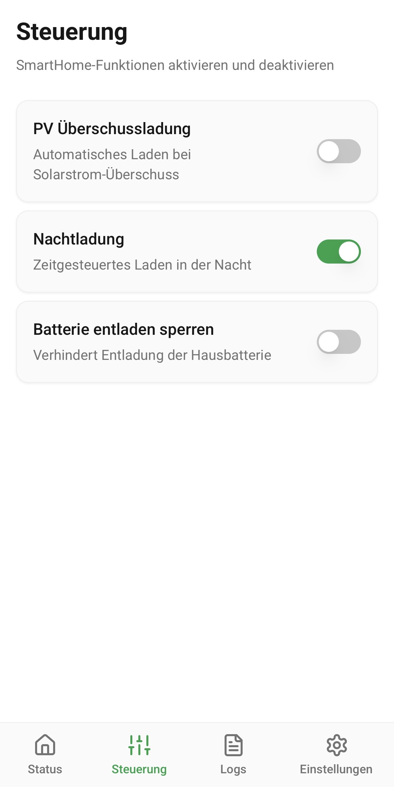

# KEBA Wallbox Steuerungs-App

Eine moderne Progressive Web App (PWA) zur komfortablen Steuerung Ihrer KEBA Wallbox Ladestation für Elektrofahrzeuge.

_Version 1.0 – November 2025_

## Über die App

Mit dieser App behalten Sie die Kontrolle über Ihre Wallbox - direkt vom Smartphone oder Tablet aus. Überwachen Sie den Ladevorgang in Echtzeit, steuern Sie das Laden und nutzen Sie intelligente SmartHome-Funktionen für optimales und kostengünstiges Laden Ihres Elektrofahrzeugs.

## Hauptfunktionen

### 📊 Echtzeit-Statusüberwachung
- **Ladeleistung:** Sehen Sie auf einen Blick die aktuelle Leistung in kW
- **Ladestrom:** Überwachen Sie den Stromfluss in Ampere über alle Phasen
- **Energie:** Verfolgen Sie die geladene Energie - wahlweise für die aktuelle Ladesitzung oder die Gesamtenergie
- **Kabelstatus:** Erkennen Sie sofort, ob das Ladekabel angeschlossen ist

### ⚡ Intelligente Ladesteuerung
- **Manueller Start/Stop:** Starten oder stoppen Sie den Ladevorgang mit einem Fingertipp
- **Ladestrom einstellen:** Passen Sie die Ladeleistung individuell an (6-16 Ampere)

### 🏡 SmartHome-Integration
Optimieren Sie Ihr Laden mit drei intelligenten Funktionen:

- **PV-Überschussladung:** Laden Sie automatisch, wenn Ihre Solaranlage überschüssigen Strom produziert - für maximale Eigenverbrauchsoptimierung
- **Nachtladung:** Nutzen Sie günstige Nachttarife durch zeitgesteuertes Laden
- **Batteriesperrung:** Verhindern Sie, dass Ihre Hausbatterie zum Laden des Autos entladen wird

### ⚙️ Einfache Einrichtung
- Wallbox-IP-Adresse konfigurieren
- SmartHome-Webhooks für FHEM-Integration einrichten
- Alle Einstellungen werden automatisch gespeichert

### 📋 Protokollierung & Diagnose
- **Logs-Seite:** Detaillierte Kommunikationsprotokolle mit der Wallbox
- Hilfreich bei der Fehlersuche und Diagnose
- Alle Befehle und Antworten werden aufgezeichnet

## Screenshots

### Status-Seite
Behalten Sie den Überblick über Ihre aktuelle Ladesitzung:

### Steuerung
Aktivieren Sie SmartHome-Funktionen mit einem Fingertipp:

### Einstellungen
Konfigurieren Sie Ihre Wallbox und SmartHome-Verbindungen:

### Logs
Detaillierte Kommunikationsprotokolle zur Fehlersuche und Diagnose:

## Voraussetzungen

- **KEBA Wallbox** (kompatible Modelle mit UDP-Schnittstelle)
- **Netzwerkverbindung:** Wallbox und Smartphone/Tablet im gleichen lokalen Netzwerk
- **Optional:** FHEM SmartHome-System für automatische Ladefunktionen
- **Browser:** Moderner Webbrowser (Chrome, Safari, Firefox, Edge)

## Installation & Nutzung

### Als Progressive Web App (PWA) installieren

1. **App öffnen:** Öffnen Sie die App-URL in Ihrem mobilen Browser
2. **Zum Startbildschirm hinzufügen:**
   - **iOS (Safari):** Tippen Sie auf das Teilen-Symbol und wählen Sie "Zum Home-Bildschirm"
   - **Android (Chrome):** Tippen Sie auf das Menü (⋮) und wählen Sie "Zum Startbildschirm hinzufügen"
3. **App starten:** Die App erscheint wie eine normale App auf Ihrem Startbildschirm

### Erste Schritte

1. **Wallbox-IP einstellen:**
   - Gehen Sie zur Einstellungen-Seite (Zahnrad-Symbol)
   - Tragen Sie die IP-Adresse Ihrer Wallbox ein (z.B. 192.168.40.16)
   - Die Standard-IP ist bereits voreingetragen

2. **SmartHome-URLs konfigurieren (optional):**
   - Wenn Sie FHEM nutzen, tragen Sie die Webhook-URLs ein
   - Die App synchronisiert dann automatisch mit Ihren SmartHome-Geräten
   - Standard-URLs sind bereits als Beispiel eingetragen

3. **Loslegen:**
   - Wechseln Sie zur Status-Seite
   - Sie sehen nun alle aktuellen Ladedaten
   - Nutzen Sie die Steuerung für intelligente Ladefunktionen

## Funktionsweise der SmartHome-Funktionen

### PV-Überschussladung
Wenn aktiviert:
- Die App kommuniziert mit Ihrer Solaranlage über FHEM
- Bei Stromüberschuss wird automatisch geladen
- Bei wenig Sonne wird der Ladevorgang pausiert
- **Hinweis:** Der Ladestrom-Regler wird deaktiviert, da die Leistung automatisch gesteuert wird

### Nachtladung
Wenn aktiviert:
- Zeitgesteuertes Laden nach FHEM-Zeitplan
- Ladestrom wird automatisch auf Maximum gesetzt
- Ideal für günstige Nachtstromtarife
- Sie können den Ladestrom manuell anpassen

### Batteriesperrung
Wenn aktiviert:
- Ihre Hausbatterie wird nicht zum Laden des E-Autos genutzt
- Verhindert unnötige Lade-/Entladeverluste der Hausbatterie
- Die Wallbox lädt nur mit Netzstrom oder direktem PV-Überschuss

## Häufige Fragen (FAQ)

**Warum wird kein Status angezeigt?**
- Prüfen Sie, ob Smartphone und Wallbox im gleichen WLAN sind
- Überprüfen Sie die IP-Adresse in den Einstellungen
- Starten Sie die App neu

**Der Ladestrom-Regler ist ausgegraut - warum?**
- Bei aktivierter PV-Überschussladung wird der Strom automatisch geregelt
- Deaktivieren Sie PV-Überschussladung, um manuell zu steuern
- Wenn kein Kabel angeschlossen ist, kann der Strom nicht eingestellt werden

**Wie sehe ich, ob extern Änderungen vorgenommen wurden?**
- Die App synchronisiert alle 10 Sekunden automatisch mit FHEM
- Externe Änderungen werden automatisch angezeigt
- Schalter auf der Steuerungs-Seite aktualisieren sich automatisch

**Kann ich die App auch unterwegs nutzen?**
- Die App ist für die Nutzung im lokalen Heimnetzwerk konzipiert
- Für Fernzugriff benötigen Sie VPN oder eine sichere Port-Weiterleitung
- **Sicherheitshinweis:** Schützen Sie den Zugriff auf Ihre Wallbox!

**Wo finde ich Fehlerprotokolle?**
- Wechseln Sie zur Logs-Seite (Listen-Symbol in der Navigation)
- Hier sehen Sie alle Kommunikationsdetails mit der Wallbox
- Hilfreich bei Problemen zur Fehlersuche

## Technische Details

- **Entwickelt als:** Progressive Web App (PWA)
- **Design:** Material Design 3 Prinzipien
- **Optimiert für:** Mobile Geräte (Smartphones & Tablets)
- **Sprache:** Deutsch
- **Offline-Fähigkeit:** App funktioniert auch ohne Internetverbindung (nur lokales Netzwerk erforderlich)

## Sicherheitshinweise

- Die App kommuniziert nur im lokalen Netzwerk
- Keine Daten werden an externe Server gesendet
- Schützen Sie Ihr WLAN-Netzwerk mit einem sicheren Passwort
- Bei Fernzugriff: Verwenden Sie VPN statt Port-Weiterleitung

## Support & Feedback

Bei Fragen oder Problemen:
- Überprüfen Sie zunächst die FAQ oben
- Schauen Sie in die Logs-Seite für detaillierte Fehlerinformationen
- Stellen Sie sicher, dass alle Netzwerkverbindungen funktionieren

## Lizenz & Haftungsausschluss

Diese Software wird "wie besehen" zur Verfügung gestellt. Die Nutzung erfolgt auf eigene Verantwortung. Der Entwickler übernimmt keine Haftung für Schäden, die durch die Nutzung dieser App entstehen könnten.

---

**Viel Erfolg beim intelligenten Laden Ihres Elektrofahrzeugs! ⚡🚗**
